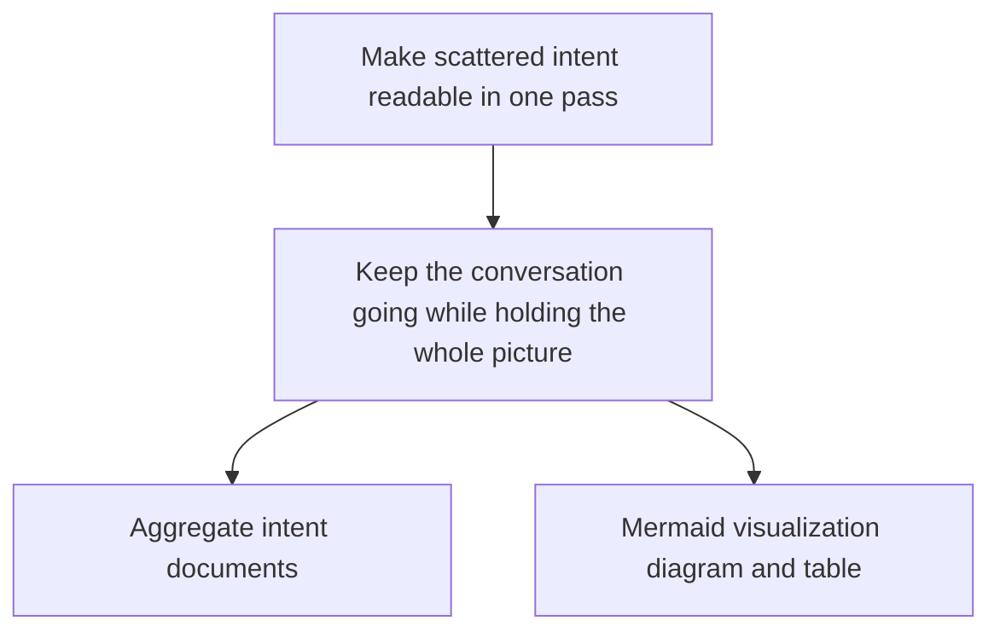

# Mermaid visualization rule for the intent-tree

Canonical reference for how the `intent-overview` skill renders the L0→L4 hierarchy of `intent-tree.md` as a diagram. SKILL.md holds only the procedure and report format; the Mermaid generation method, escaping conventions, and the text-alongside discipline defer to this rule. The output of this rule is confined to the derived views under `.intent/overview/`; it never writes to canonical sources (`.intent/*.md`, including `intent-tree.md`) — read-only. Judgment is limited to natural-language heuristics and reading existing artifacts; it does not depend on an AST, external scanners, or external renderers (INV2).

## Render target and pure-Mermaid principle (R3.1)

- The render target is the items under each of the `## L0:`–`## L4:` headings in `intent-tree.md`. Output the hierarchy — L0 at the top, L4 at the bottom — as pure, self-authored Mermaid `graph` text.
- The default direction is `graph TD` (Top-Down), because a top-to-bottom hierarchy reads most clearly.
- The output is only Mermaid syntax wrapped in a ` ```mermaid ` … ` ``` ` code fence. Do not use external plugins, custom notations, image generation, theme extensions, or external renderers (INV2 = zero dependencies; diagram correctness is not made to depend on a renderer implementation — it is guaranteed by the text written alongside).
- Edges connect "an item at the parent L level → an item at the child L level" with `-->`. When the parent-child correspondence cannot be read unambiguously from `intent-tree.md`, do not draw that edge (do not connect by guessing) and instead record the items as siblings at the same level in the text hierarchy.

## Node-ID convention (collision avoidance)

A node ID is the identifier the renderer interprets, kept separate from the label (the displayed string). IDs are derived mechanically and stably and are not generated from the label text.

- **Allowed characters**: ASCII alphanumerics and the underscore `_` only. The first character must be a letter. Do not include non-ASCII text, symbols, or spaces in an ID.
- **Derivation rule**: derive the ID mechanically as `L<level number>_<0-based occurrence index within the same level>`. Examples: the sole L0 item is `L0_0`; the first L2 item is `L2_0`; the second L2 item is `L2_1`.
- **Collision avoidance**: because (level, within-level index) is unique, the ID is also unique. Since it does not depend on the label string, IDs never collide even when items share the same name, are empty, or contain special characters. When the same item has multiple parents (is shared), define the node only once under its first-occurrence ID, and thereafter reuse that ID to add edges only (do not redefine the node).

## Label convention (escaping / stripping special characters)

Labels are wrapped in the square-bracket-plus-double-quote form `ID["..."]`. The label body must not contain characters that break Mermaid syntax.

- **Forbidden characters**: the label body must not contain `(` `)` `[` `]` `"` `/`. Strip these mechanically from the item text (delete the character and close up the surrounding text). Because stripping can change meaning, when a node has been stripped, note that in the text hierarchy described below (the text hierarchy preserves the original text and is never stripped).
- **Newlines and pipes**: collapse newlines into a single space within the label. Strip `|` (pipe) from the label.
- **Length**: for diagram readability, when a label exceeds roughly 40 characters, truncate to the first 40 characters and append `…` (even when truncated, the text hierarchy preserves the full text).
- For an item whose label body is empty (the item is blank), use `["(blank)"]`-free form, i.e. `["blank"]` (containing no forbidden characters), and state it as "blank" in the text hierarchy (do not fill in by guessing).

## Always write the text hierarchy alongside as canonical (R3.2)

- **Always** write the corresponding text hierarchy (an indented bullet list) immediately after the Mermaid diagram. This keeps read-through unblocked even in environments where the diagram fails to render; the text hierarchy is the basis for reading in the overview view (the source of truth within this view).
- The text hierarchy preserves the original text of `intent-tree.md`. Escaping, stripping, and truncation performed for labels are not applied to the text hierarchy; record it verbatim (when stripping or truncation was performed for a label, the corresponding text line may be annotated).
- State in the view that this block is derived and is regenerable from `intent-tree.md` as the source of truth (it updates on re-run, not by hand-editing).

## When the intent-tree is empty / not yet generated (R3.3)

- When `intent-tree.md` does not exist, or none of `## L0:`–`## L4:` contains any item (all levels blank), **do not output the Mermaid diagram**.
- State the reason for omitting the diagram explicitly ("nothing to visualize because the intent-tree is empty / not yet generated") and direct the user to the skill to run first (`/intent-discover`). Do not generate nodes by guessing.
- When only some levels are blank, do not omit the diagram; represent blank levels with a "blank" label plus an explicit note in the text hierarchy.

## Example (a small L0→L2 tree)

Suppose `intent-tree.md` reads as follows (one L0 item, one L1 item, two L2 items, where the second L2 item contains the forbidden characters `(` `)`):

- L0: Make scattered intent readable in one pass
- L1: Keep the conversation going while holding the whole picture
- L2: Aggregate intent documents / L2: Mermaid visualization (diagram and table)

The Mermaid block produced is:



The text hierarchy written alongside (canonical; preserves the original text, label stripping not applied):

- L0: Make scattered intent readable in one pass
  - L1: Keep the conversation going while holding the whole picture
    - L2: Aggregate intent documents
    - L2: Mermaid visualization (diagram and table)  ← `()` stripped in the diagram label

> This block is derived. The source of truth is `intent-tree.md`, and it is regenerated by re-running `/intent-overview`. Do not edit it by hand.
