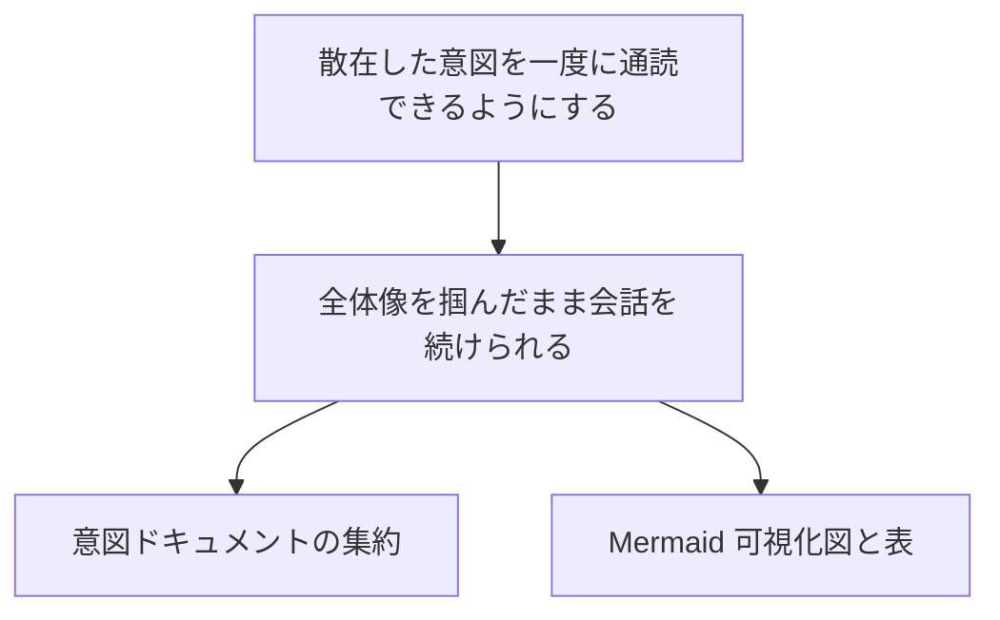

# intent-tree の Mermaid 可視化規則

`intent-overview` skill が `intent-tree.md` の L0→L4 階層を図として描画する際の正本。SKILL.md は手順と報告形式のみを持ち、Mermaid の生成方法・エスケープ規約・テキスト併記の規律は本規則を参照する。本規則の出力先は `.intent/overview/` 配下の派生ビューに限られ、canonical（`intent-tree.md` を含む `.intent/*.md`）には一切書き込まない（read-only）。判断は自然言語ヒューリスティクスと既存成果物の読み取りに限り、AST・外部スキャナ・外部レンダラには依存しない（INV2）。

## 描画対象と純 Mermaid 原則（R3.1）

- 描画対象は `intent-tree.md` の `## L0:`〜`## L4:` 各見出し配下の項目。L0 を最上位（頂点）、L4（packet 候補＝P）を最下位（末端）とする木構造を、自前で書き起こした純粋な Mermaid `graph` テキストとして出力する。
- 方向は上から下への階層が読みやすいため `graph TD`（Top-Down）を既定とする。
- 出力は ` ```mermaid ` ～ ` ``` ` のコードフェンスで囲んだ Mermaid 構文のみとする。外部プラグイン・カスタム記法・画像生成・テーマ拡張・外部レンダラを使わない（INV2＝依存ゼロ。図の正しさはレンダラ実装に依存させず、テキスト併記で担保する）。
- エッジは**必ず「上位 L レベル → 下位 L レベル」の向き**（`L<n> --> L<n+1>`）で `-->` で結ぶ。逆向き（下位→上位）のエッジは引かない。`graph TD` のランク（縦位置）はエッジの向きで決まるため、向きを誤ると L4（P）が上に浮く・L1/L2 が下に潜るなどレイアウトが崩れる。**L0 が最上段・L4 が最下段になることを、エッジの向きで常に保証する**。

## ランク崩れの防止（孤立ノードを作らない）（R3.1）

`graph TD` では、入ってくるエッジを 1 本も持たないノード（孤立ノード）はランク付けの起点となり**最上段へ浮く**。その結果「L1/L2 が下で混在し P（L4）が上に来る」といった崩れが起きる。これを防ぐため、**L0 を除くすべてのノードは必ず 1 本以上の親エッジを持たせ、孤立させない**。

- **親が一意に読める項目**: 直近上位レベルの該当する親ノードから `親 --> 子` でつなぐ。
- **親が一意に読めない項目（推測で特定の親に接続しない）**: その項目を孤立させず、**直近上位レベル全体のアンカーへつなぐ**。具体的には、各レベル `L<n>`（n≥1）に対し、上位レベル `L<n-1>` の項目が複数あって親を一意に決められないときは、`L<n-1>` 配下の項目をまとめる**レベルアンカー・ノード** `L<n-1>_anchor`（ラベル例 `["L<n-1>（親候補複数）"]`）を 1 つ定義し、`L<n-1>` の各実ノードから `L<n-1>_anchor` へ、さらに `L<n-1>_anchor --> 子` でつなぐ。これにより親が曖昧な子も縦ランク上は正しく `L<n-1>` の下に置かれ、上へ浮かない。アンカーを使った（＝親が一意でなかった）事実はテキスト階層側の注記で明示する（推測で特定の親に断定しない規律は保つ）。
- **上位レベルが空のために親を持てない項目**（例: L2 はあるが L1 が未記入）: 当該項目を孤立させず、**存在する最も近い上位レベル**（この例では L0）へ直接つなぎ、間に未記入レベルがある旨をテキスト階層側に明示する。中間レベルが空でも下位レベルが上へ浮かないようにする。
- いずれの場合も**エッジの向きは常に上位→下位**で、L0 が最上段・L4（P）が最下段になる縦順序を保つ。

## ノード ID 規約（衝突回避）

ノード ID はレンダラが解釈する識別子であり、ラベル（表示文字列）と分離する。ID は機械的・安定に導出し、ラベル本文からは生成しない。

- **使用可能文字**: 半角英数字と下線 `_` のみ。先頭は英字とする。日本語・記号・空白を ID に含めない。
- **導出規則**: ID は `L<レベル番号>_<同レベル内 0 始まりの出現順インデックス>` で機械的に導出する。例: L0 の唯一項目は `L0_0`、L2 の 1 番目は `L2_0`、L2 の 2 番目は `L2_1`。
- **衝突回避**: 上記規則は (レベル, 同レベル内インデックス) が一意であるため ID も一意になる。ラベル文字列に依存しないので、同名・空・特殊文字を含む項目があっても ID は衝突しない。同じ項目が複数の親を持つ（共有される）場合も、ノードは初出 ID 1 つのみ定義し、以降はその ID を再利用してエッジだけを追加する（ノードを再定義しない）。

## ラベル規約（特殊文字エスケープ／除去）

ラベルは `ID["..."]` の角括弧＋二重引用符記法で囲む。ラベル本文には Mermaid 構文を壊す文字を入れない。

- **禁止文字**: ラベル本文に `(` `)` `[` `]` `"` `/` を含めてはならない。これらは項目テキストから機械的に除去（その文字を削除して前後を詰める）する。除去によって意味が変わりうるため、除去を行ったノードがある場合はその旨を後述のテキスト階層側の注記で補う（テキスト階層は除去せず原文を保持する）。
- **改行・パイプ**: 改行はラベル内では半角スペース 1 個に畳む。`|`（パイプ）はラベルから除去する。
- **長さ**: 図の可読性のため、ラベルが概ね 40 文字を超える場合は先頭 40 文字に切り詰め末尾を `…` とする（切り詰めた場合もテキスト階層側は全文を保持する）。
- ラベル本文が空（項目が未記入）の項目は、ラベルを `["(未記入)"]` ではなく `["未記入"]`（禁止文字を含めない）とし、テキスト階層側で「未記入」として明示する（推測で埋めない）。

## テキスト階層を正本として常に併記（R3.2）

- Mermaid 図のすぐ後に、対応するテキスト階層（インデント付き箇条書き）を**常に**併記する。図が壊れて描画されない環境でも通読が止まらないようにするためで、テキスト階層こそが俯瞰ビューにおける読み取りの拠り所（このビュー内での正本）である。
- テキスト階層は `intent-tree.md` の原文を保持する。ラベルで行ったエスケープ・除去・切り詰めはテキスト階層側には適用せず、原文のまま記す（除去・切り詰めをラベルで行った場合は、対応するテキスト行に補足できる）。
- ビューには本ブロックが派生（derived）であり、`intent-tree.md` を正本として再生成可能であること（手編集せず再実行で更新されること）を明示する。

## intent-tree が空／未生成のとき（R3.3）

- `intent-tree.md` が存在しない、または `## L0:`〜`## L4:` のいずれにも項目が無い（全レベル未記入）場合は、**Mermaid 図を出力しない**。
- 図を省略した理由（「intent-tree が空／未生成のため可視化対象がない」）を明示し、先に実行すべきスキル（`/intent-discover`）を案内する。推測でノードを生成しない。
- 一部のレベルのみ未記入の場合は図を省略せず、未記入レベルを「未記入」ラベル＋テキスト階層側の明示で表現する。

## 例（L0→L2 の小さなツリー）

`intent-tree.md` が次のように読み取れたとする（L0 に 1 項目、L1 に 1 項目、L2 に 2 項目、L2 の 2 番目に禁止文字 `(` `)` を含む）:

- L0: 散在した意図を一度に通読できるようにする
- L1: 全体像を掴んだまま会話を続けられる
- L2: 意図ドキュメントの集約／L2: Mermaid 可視化（図と表）

このとき生成する Mermaid ブロック（L0 が頂点、各エッジは上位→下位。すべての L2 が L1 の下に接続され孤立しない）:



併記するテキスト階層（正本。原文を保持し、ラベルの除去は適用しない）:

- L0: 散在した意図を一度に通読できるようにする
  - L1: 全体像を掴んだまま会話を続けられる
    - L2: 意図ドキュメントの集約
    - L2: Mermaid 可視化（図と表）  ← 図のラベルでは `()` を除去

> このブロックは派生（derived）です。正本は `intent-tree.md` であり、`/intent-overview` の再実行で再生成されます。手編集しないでください。
